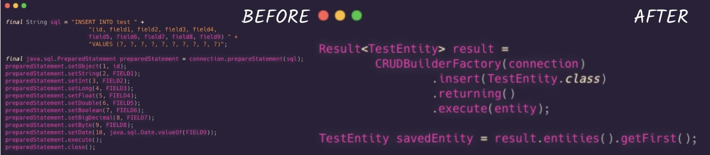

# utils.dao

A Java library, designed to simplify your database CRUD, using a Fluent API!

[](./LICENSE)

---

This is a library to abstract common database queries and operations. The main goal is to ease the devlopment, allowing the focus to remain on the business rules, and not on the data access.



---

## Features

- **Fluent API**: Build the queries elegantly and simple.
- **Object Relational Mapping (ORM)**:  Map your entities to your database using the annotations `@Table` and `@Field`.
- **CRUD**: Build your CRUD operations easily.
- **Pagination**: Supports pagination through `LIMIT` and `OFFSET`.
- **JOIN**: Suppports JOIN operations using `LEFT` and `INNER`.

## How to Use

This section will show how to use the library, including small snippets of code for each situation.

### Entities
If no value is specified within the annotation, a default naming convention will be adopted.

```java
@Table()
public class MyEntity { // table name = public.my_entity
    @Field(primaryKey = true)
    private int id; // field name = id

    @Field
    private String myFirstField; // field name = my_field_name

    @Field(name = "other_entity_id")
    private int entityId; // field name = other_entity_id
}
```

```java
@Table(name = "my_second_entity")
public class Entity { // table name = public.my_second_entity
    @Field(primaryKey = true)
    private int id;

    @Join(
        on = @JoinOn(localField = "id", foreignField = "other_entity_id")
    ) // Relation: 1:N
    private List<MyEntity> myEntityList; // join public.my_entity ON other_entity_id = public.my_second_entity.id

    // You can also specify the class to JOIN
    @Join(
        clazz = MyEntity.class,
        on = @JoinOn(localField = "id", foreignField = "other_entity_id")
    ) // Relation: N:1
    private OtherEntity otherEntity; // join public.my_entity ON other_entity_id = public.my_second_entity.id
}
```

### Insert
```java
Result<Entity> result = 
    new CRUDBuilderFactory(connection).insert(Entity.class)
        .returning()
        .execute(entity);
```

### Select
```java
Result<Entity> result = 
    new CRUDBuilderFactory(connection).select(Entity.class)
        .where("id").equals(1)
        .and("my_entity.id").in(List.of(1, 2, 3))
        .leftJoin()
        .page(2);
```

### Update
```java
Result<Entity> result =
    new CRUDBuilderFactory(connection).update(Entity.class)
        .execute(entity);
```

### Delete
```java
Result<Entity> result =
    new CRUDBuilderFactory(connection).delete(Entity.class)
        .execute(entity);
```

## Technologies

- [Java 21](https://www.java.com/en/)
- [Maven](https://maven.apache.org) (Build and Dependency Management)
- [SonarQube](https://www.sonarsource.com/products/sonarqube/)

## Databases

Currently the library is designed to support the following databases:

- [PostgreSQL](https://www.postgresql.org)

## Quality Assurance

[](https://sonarcloud.io/summary/new_code?id=luanpozzobon_utils.dao)
[](https://sonarcloud.io/summary/new_code?id=luanpozzobon_utils.dao)
[](https://sonarcloud.io/summary/new_code?id=luanpozzobon_utils.dao)
[](https://sonarcloud.io/summary/new_code?id=luanpozzobon_utils.dao)
[](https://sonarcloud.io/summary/new_code?id=luanpozzobon_utils.dao)

[](https://sonarcloud.io/summary/new_code?id=luanpozzobon_utils.dao)
[](https://sonarcloud.io/summary/new_code?id=luanpozzobon_utils.dao)

## Author

<table>
    <tr>
        <td align="center">
            <a href="http://github.com/luanpozzobon">
            <br>
            <sub>
                <b>luanpozzobon</b>
            </sub>
            </a>
        </td>
        <td align="center">
            <a href="https://www.linkedin.com/in/luanpozzobon/">
            <br>
            <sub>
                <b>LinkedIn: Luan Pozzobon</b>
            </sub>
            </a>
        </td>
    </tr>
</table>